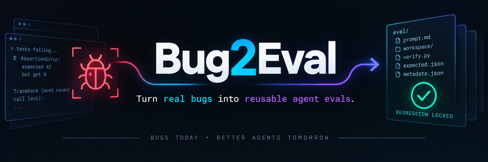
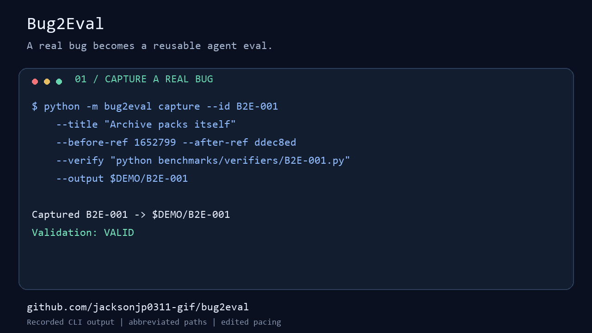

<p align="center">
  
</p>

# Bug2Eval

[](https://github.com/jacksonjp0311-gif/bug2eval/actions/workflows/ci.yml)
[Latest release](https://github.com/jacksonjp0311-gif/bug2eval/releases/latest) · [Public benchmarks](benchmarks/README.md) · [Case format](docs/FORMAT.md)

> **Every bug you fix should make your agents harder to fool next time.**

**Bug2Eval turns a real, fixed software bug into a portable regression evaluation that you can replay against any coding agent.**

A bug already gave you something valuable: a concrete failure, a real codebase, and a known-good fix. Bug2Eval captures that evidence before it disappears into Git history.

```text
real bug  →  failing snapshot  →  fixed snapshot  →  deterministic verifier
                                             ↓
                                      reusable .b2e eval
                                             ↓
                         any coding agent / local agent / CI
```

## Why this exists

Most teams fix a bug and throw away the learning opportunity. The regression test remains, but the **agent task** does not: the original broken workspace, problem statement, success command, reference outcome, and provenance are scattered or lost.

Bug2Eval turns that one-time debugging event into an asset you can use repeatedly to:

- benchmark a new coding agent or model;
- detect regressions in your agent harness;
- compare prompts and tool configurations;
- create a private eval corpus from your own engineering history;
- turn production failures into durable training/evaluation material;
- reproduce the exact "before fails / after passes" contract.

## 30-second start

Install from the published repository (PyPI publication is pending):

```bash
git clone https://github.com/jacksonjp0311-gif/bug2eval.git
cd bug2eval
python -m pip install -e .
python -m bug2eval validate benchmarks/B2E-001.b2e
```

Expected result: `B2E-001: VALID`, with before exit `1` and after exit `0`.
This command works in PowerShell, Bash, and zsh. Python must be available as `python`
on PATH. You can also install the wheel from the latest GitHub release.

## Capture your own fix

In your project's repository, make the same regression test available in both
commits. Run it once before and once after the application fix. Install that
project's test dependencies in your environment; they are not bundled in a case.

```bash
bug2eval init

# After committing the fix:
bug2eval capture \
  --id BUG-018 \
  --title "Reject division by zero" \
  --before-ref HEAD~1 \
  --after-ref HEAD \
  --verify "python -m pytest -q"

bug2eval validate .bug2eval/cases/BUG-018
```

A valid case proves two things before Bug2Eval accepts it:

```text
BEFORE snapshot + verify command  -> FAIL
AFTER  snapshot + verify command  -> PASS
```

That discrimination check prevents "evals" that never actually reproduce the bug.
`run` also validates the reference case before invoking an agent. An already passing
starting snapshot or a failing reference fix is rejected with exit code `2`.

## Protect the verifier

Bug2Eval fingerprints the verifier before the agent runs. If a protected file is
changed, deleted, replaced by a symlink, or a protected folder gains files, the run
fails. A modified verifier is not executed. The protected files must also be
identical in the captured before and after snapshots.

Direct script paths in `--verify` are detected automatically. For pytest, common
test folders and configuration are included. Declare additional helpers, fixtures,
or custom configuration with repeatable `--protect` options:

```bash
bug2eval capture --id API-204 --title "Handle empty headers" --before-ref HEAD~1 --after-ref HEAD --verify "python verify.py" --protect verify.py --protect test_support
```

Paths are relative to the captured workspace and must exist in both snapshots.
When no verifier files can be identified, validation fails and asks for `--protect`.
Run receipts include `verifier_integrity` with the protected and changed paths.
The generated agent task lists the protected paths too.

This is file tamper detection, not an adversarial execution sandbox. Declare every
verifier dependency; inferred paths cannot identify arbitrary imports or external
tools. Use an isolated evaluator for untrusted agents and third-party cases.

## Run the eval against any agent

Bug2Eval deliberately does **not** depend on an agent SDK. Give it any local command.

```bash
bug2eval run .bug2eval/cases/BUG-018 \
  --agent-cmd 'your-agent --workspace {workspace} --task {task_file}'
```

Available placeholders:

| Placeholder | Meaning |
|---|---|
| `{workspace}` | isolated copy of the broken snapshot |
| `{task_file}` | generated `BUG2EVAL_TASK.md` for the agent |
| `{prompt_file}` | original captured bug prompt |

The agent also receives `BUG2EVAL_WORKSPACE`, `BUG2EVAL_TASK_FILE`, `BUG2EVAL_PROMPT_FILE`, `BUG2EVAL_CASE_ID`, and `BUG2EVAL_VERIFY_COMMAND` environment variables.

No adapter? No problem. A wrapper script is enough.

## One-file sharing

```bash
bug2eval pack .bug2eval/cases/BUG-018
# -> .bug2eval/cases/BUG-018.b2e

bug2eval validate BUG-018.b2e
bug2eval inspect BUG-018.b2e --json
```

A `.b2e` is just a portable ZIP container with a stable machine-readable contract.
Packing requires a `.b2e` output path and rejects destinations that overwrite case
metadata or artifacts. It writes a temporary archive before replacing an existing
bundle, so a failed pack leaves the previous bundle intact.

## Capture from Git or arbitrary directories

### Git history

```bash
bug2eval capture \
  --id API-204 \
  --title "Retry loop terminates after transient 503" \
  --before-ref abc123 \
  --after-ref def456 \
  --verify "python -m pytest tests/test_retry.py -q"
```

### Two directory snapshots

Useful for generated code, vendored fixtures, non-Git projects, and agents working in scratch workspaces:

Place the output outside both source directories. `--force` replaces an existing
case only; it cannot replace the source workspace or an unrelated folder.

```bash
bug2eval capture \
  --id PARSER-9 \
  --title "Parser handles empty header" \
  --before-dir ./broken \
  --after-dir ./fixed \
  --verify "python verify.py"
```

## Case anatomy

```text
BUG-018/
├── metadata.json                   # canonical machine contract
├── prompt.md                       # task/problem statement
├── README.md                       # human-readable case card
├── artifacts/
│   ├── workspace_before.tar.gz     # known-broken workspace
│   └── workspace_after.tar.gz      # known-good reference workspace
└── results/                        # generated run receipts
```

Every captured artifact is SHA-256 checksummed. `validate`, `inspect`, and `run` verify integrity before using it.

## Agent contract

Agents should treat Bug2Eval as a simple protocol:

1. Read `metadata.json`.
2. Start from `artifacts.workspace_before`.
3. Read `prompt.md` or generated `BUG2EVAL_TASK.md`.
4. Modify only the isolated workspace.
5. Do not weaken or bypass the verifier.
6. Execute `verification.argv`.
7. Exit successfully only when the verifier exits `0`.

See [`AGENTS.md`](AGENTS.md), [`skills/bug2eval/SKILL.md`](skills/bug2eval/SKILL.md), and [`schemas/case.schema.json`](schemas/case.schema.json).

## Designed for repeatability

Bug2Eval is intentionally boring where infrastructure should be boring:

- **zero runtime dependencies**;
- Python 3.10+;
- commands stored as argument arrays, not arbitrary shell scripts;
- checksummed artifacts;
- safe archive extraction guards;
- command timeouts;
- deterministic pass/fail contract;
- human-readable and JSON output;
- model/vendor-agnostic agent invocation;
- packed `.b2e` cases for transport;
- CI-tested on Linux, macOS, and Windows.

## CLI

```text
bug2eval init
bug2eval capture
bug2eval validate CASE
bug2eval run CASE [--agent-cmd "..."]
bug2eval inspect CASE [--json]
bug2eval pack CASE
bug2eval unpack CASE.b2e
```

Useful machine mode:

```bash
bug2eval validate BUG-018.b2e --json
bug2eval inspect BUG-018.b2e --json
bug2eval run BUG-018.b2e --agent-cmd "..." --json
```

Exit codes:

| Code | Meaning |
|---:|---|
| `0` | success / eval passed |
| `1` | evaluated workspace failed verification |
| `2` | invalid or non-discriminating case |
| `3` | tool/input/system error |
| `130` | interrupted |

## The quality rule

A Bug2Eval case is not considered valid because somebody says the bug is fixed. It is valid only when the same verifier distinguishes the snapshots:

```text
verify(before) != 0
verify(after)  == 0
```

That tiny invariant is the heart of the project.

## Security model

A Bug2Eval case contains source code and can execute the verification command recorded by the case author. Treat third-party `.b2e` files like third-party repositories: inspect them before running them, use a sandbox/container for untrusted code, and never place secrets in captured workspaces.

Bug2Eval never needs API keys and does not transmit code by itself.

## Development

```bash
python -m venv .venv
# PowerShell: .\.venv\Scripts\Activate.ps1
# Bash/zsh: source .venv/bin/activate
python -m pip install -e ".[dev]"
python -m pytest
python -m bug2eval --help
```

## Real bugs, captured



The [public benchmark collection](benchmarks/README.md) starts with **three real
Bug2Eval defects** found during release review. Every case was replayed on Windows
with the same verifier: before fails, after passes. Two cases are cross-platform;
one specifically tests Windows quoting. These are project bugs, not synthetic
mutations or measured agent scores.

```bash
python -m bug2eval validate benchmarks/B2E-001.b2e
python benchmarks/validate_collection.py
```

The demo replays recorded CLI output, with paths abbreviated and pauses edited.
It shows capture, validation, and packing; it does not claim an agent solved the case.

## What should come next?

The format is intentionally small enough for an ecosystem to grow around it: GitHub Action ingestion, dataset exporters, agent-specific convenience adapters, corpus analytics, flaky-eval detection, and patch-quality scoring can all sit on top without changing the core case contract.

## License

MIT. Build on it, integrate it, benchmark with it.

---

<p align="center"><strong>BUGS TODAY • BETTER AGENTS TOMORROW</strong></p>
